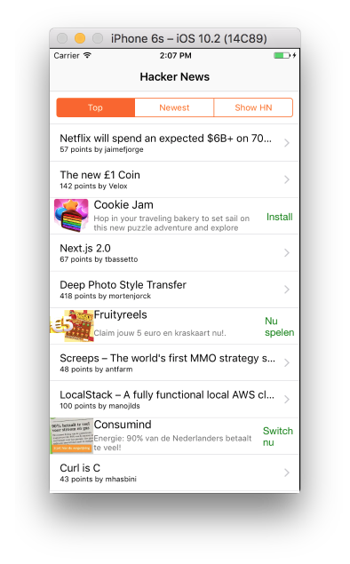
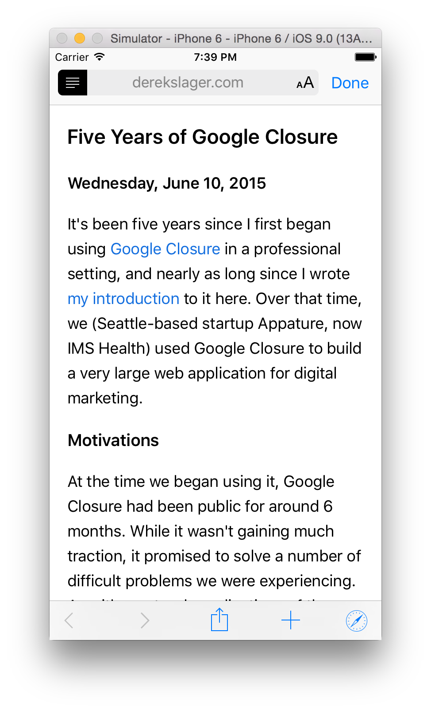

# HackerNews

A Hacker News reader iOS app written in Swift.

## Features

* View "top", "newest", and "show" posts from Hacker News.
* Read posts using the `SFSafariViewController` component.
* Uses the official [Firebase-based Hacker News API](https://github.com/HackerNews/API).

## Getting Started

1. `git clone https://github.com/amitburst/HackerNews.git`
2. `cd HackerNews`
3. `pod install` (requires [CocoaPods](https://cocoapods.org))
4. Open `HackerNews.xcworkspace` in Xcode 8.0 or higher.

## Contributing

Please feel free to help out with this project! If you see something that could be made better or want a new feature, open up an issue or send a Pull Request! I don't really plan on putting this out on the App Store, but I think it's a great learning resource for those interested in iOS development with Swift.

## Screenshots

## License

[MIT](LICENSE)
